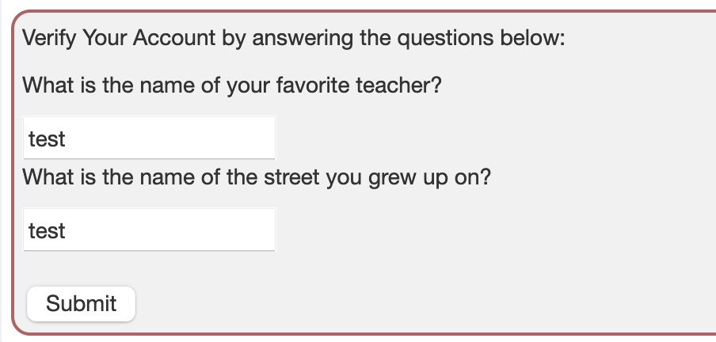
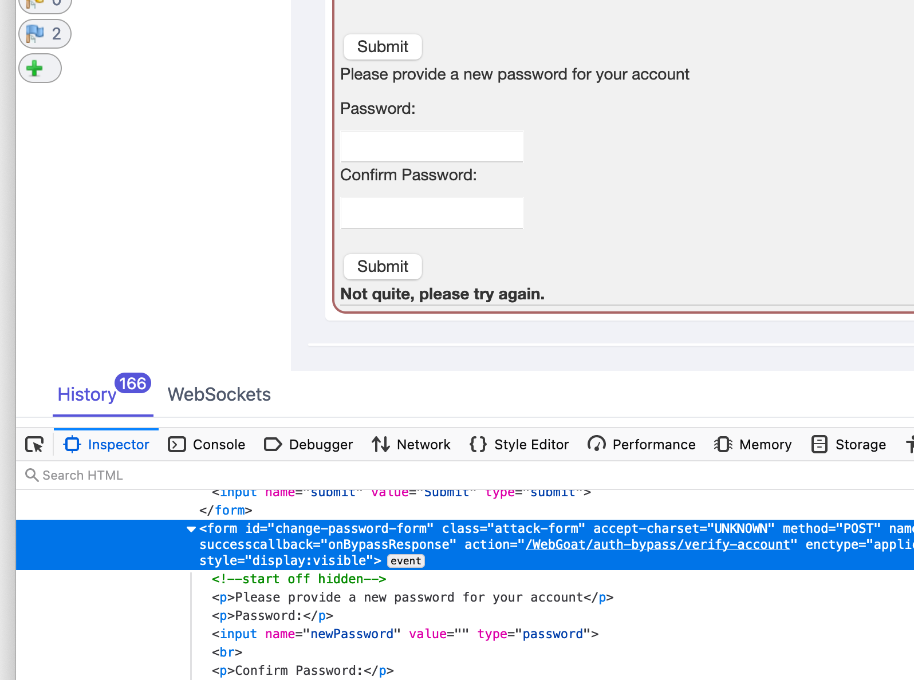
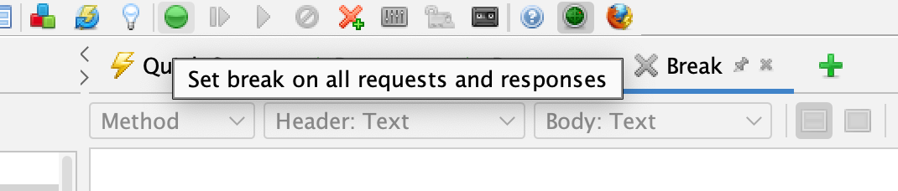
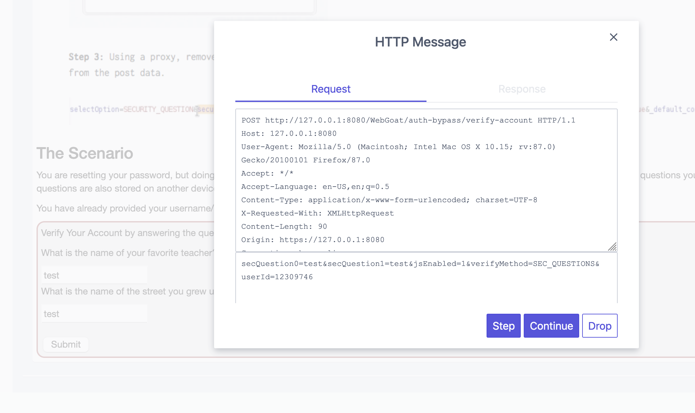
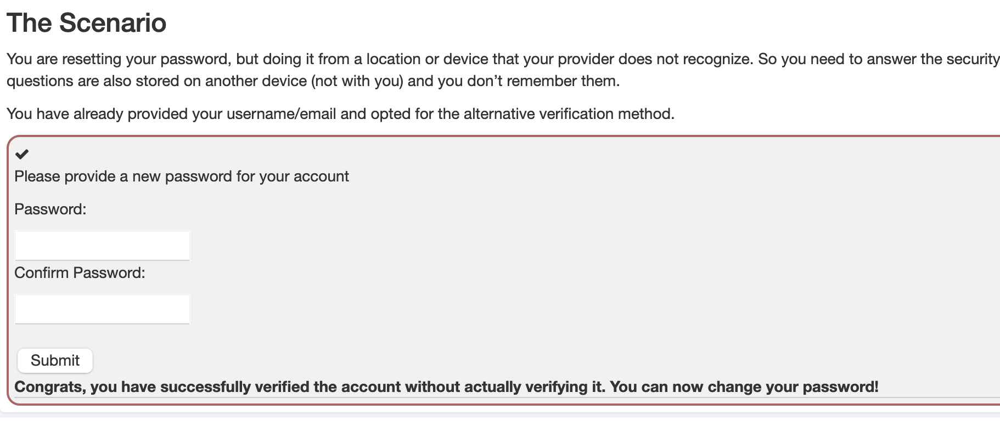
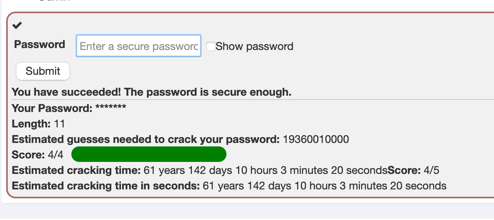
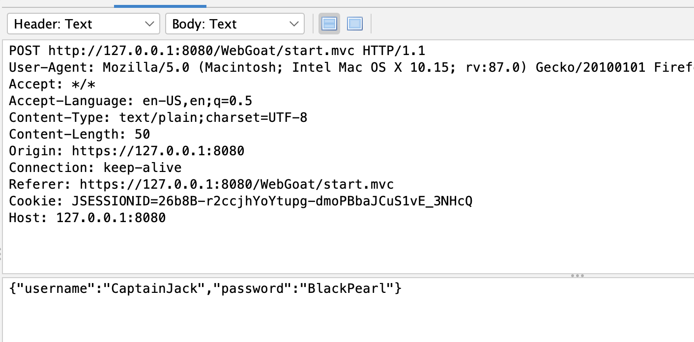
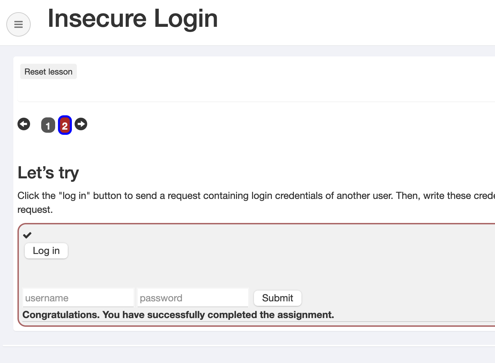
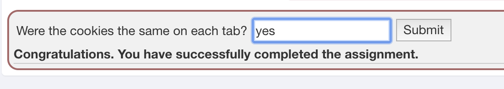
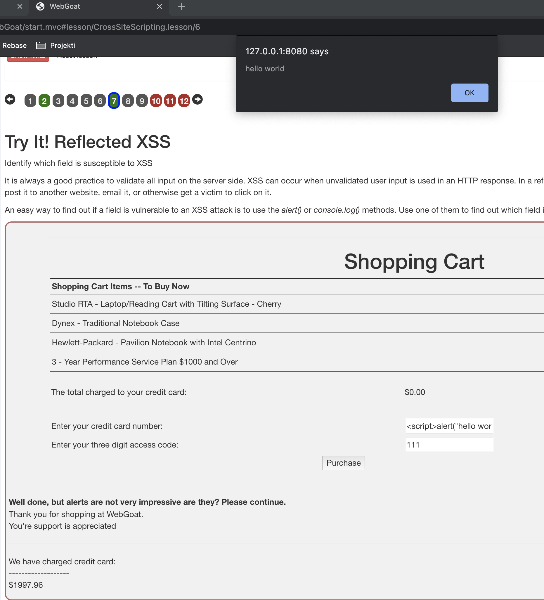

# H3 - Social Engineering

Solutions for week three [assignments](https://terokarvinen.com/2021/hakkerointi-kurssi-tunkeutumistestaus-ict4tn027-3005/#h3-social-engineering-ja-vahan-vuohikin).

## Table of Contents

* [Assignments](#assignements)
  * [z](#z-read-and-reference-materials-from-the-week)
  * [a](#a-analyze-social-engineering-hack)
  * [b1](#b1-read-and-reference-one-of-rikus-sources)
  * [b2](#b2)
  * [c](#c-add-a-link-to-your-assignments-to-course-comments)
  * [d](#d-try-the-chrome-zeroday-exploit)
* [References](#references)

---

## Assignments

### z) Read and reference materials from the week

<b>Riku Juurikko: Social engineering</b>

Riku's presentation was a really good introduction to social engineering. It talked about anatomy of a cyber attack, what is social engineering, how to influence people, different ways to phish and how to defend against all of this. Riku also gave real life examples of the methods described, as he has experience in doing pentesting.

He had created a set of principles for influencing people, that involve different mechanics like creating false sense of urgency or scarcity. You could combine these principles to have more profound effect. For example you could say, that there is a limit (scarcity) of ten movie tickets available for fives days for the first (urgency) ten people who answer this survey, where the survey link would be malicious link. Some techniques are more effective than others depending on the context and target. Authority is a good example, that is really tied to context. For example your teacher wouldn't have much authority outside school context.

To be successful in phishing, there needs to be a valid source, for example email needs to be close enough to the targets actual organisation (fake.corp.com -> fake-corp.com). Authentic signature was a good way to get people clicking your links. Additionally real reason like COVID-19 is really effective. Combine all these practices with the principles of influencing for maximum effect. In addition he talked about three major ways for phishing; email, sms and phone.

To protect against social engineering, we need to identify the principles of persuasion. We should not click anything immediately or blindly. Stop and think, when something feels weird, uncertain or unpleasant. You could ask opinion from someone else. If a message invokes strong feelings, you should think about why. If you get a call about something asking for you to do anything strange, you might hangup and call them back. For example, if your IT-department asks for your credentials for some reason, you might hangup and call them back.

---
* OWASP 10 (2017) attacks
  - A1: Injection
    - Attack vectors
      - Almost any source of data can be an injection vector, for example:
        - environment variables
        - parameters
        - external and internal web services
        - all types of users
    - Security Weakness
      - particularly in legacy code
      - often found in SQL, LDAP, XPath, or NoSQL queries, OS commands, XML parsers, SMTP headers, expression languages, and ORM queries
    - Impacts
      - can result in data loss, corruption, or disclosure to unauthorized parties, loss of accountability, or denial of access
      - Injection can sometimes lead to complete host takeover
      - Potentially major business impact
    - Attack Scenario
      - Try manipulating inputs and see, if it affects the query results
        - For example try adding SQL injection to web services query parameter:
          ```shell
          curl "http://example.com/app/accountView?id=' or '1'='1"
          ```
    - Prevent
      - Validate inputs
      - Convert all inputs to strings
      - Use parametrized queries
      ---
  - A2 Broken Authentication
    - Attack Vectors
      - Password lists / credential dumps
      - Default account credentials
      - Dictionary attack tools
    - Security Weakness
      - Wide spread issue due to bad designs
      - Manual and automatic detection
      - Automated tools to bypass broken authentication
    - Impacts
      - Access between few user accounts to complete control of the system
      - Money laundering, social security fraud, IP theft, etc.
    - Attack Scenario
      - Use a list of known passwords
      - Bruteforcing
      - Default credentials, eg. admin / admin
    - Prevent
      - Use MFA when possible
      - Don't use default credentials
      - Don't use weak or known passwords
      - Harden APIs
      - Limit amout of logins
      - Use a server-side, secure, built-in session manager
      ---
  - A3 Sensitive Data Exposure
    - Attack Vectors
      - steal keys
      - execute man-in-the-middle attacks
      - steal clear text data off the serve
      - manual attack is generally required
      - previously retrieved password databases could be bruteforced
    - Security Weakness
      - not encrypting sensitive data
      - weak key generation and management
      - weak algorithm, protocol and cipher usage
      - weak password hashing storage techniques
      - data in transit, server side weaknesses easy to detect
    - Impacts
      - all data is compromised
    - Attack Scenario
      - SQL injection to decrypt data
      - No HTTPS/TLS encryption on web site allows to read all data in transit by monitoring network traffic
      - cracking unsalted hashes
    - Prevent
      - classify and protect data accordingly
      - encrypt critical data at rest and in transit
      - salt hashes
      - disable caching from responses containing sensitive data
      - use up-to-date standard algorithms, protocols, keys and ciphers when encrypthing data
      ---
  - A7 Cross Site Scripting
    - Attack Vectors
      - Automatic tools can detect and exploit XSS vulnerabilities
    - Security Weakness
      - Mature web frameworks contain vulnerabilities, that automatic tooling can detect
    - Impacts
      - remote code execution on the victim's browser
        - steal credentials, sessions, or deliver malware
    - Attack Scenario
      - HTML input stores unsanitary data allowing attacker to store malicious code
    - Prevent
      - Use frameworks that automatically escape XSS by design
      - Escaping untrusted HTTP request data
      - Applying context-sensitive encoding
      - Enabling a Content Security Policy (CSP)
---
* Santos et al 2018: Hacking Web Applications The Art of Hacking Series LiveLessons (video): Security Penetration Testing for Today's DevOps and Cloud Environments: Lesson 5: Authentication and Session Management Vulnerabilities
  - authentication, authorization and session management
    - who are you, are you authorized to access and do you have a session
  - confideliaty with SSL/TLS
  - common web auth schemes
    - SSL/TLS mutual authentication
      - Certificate Authorities (CA) sign certificates
      - Root certificate identifies a root certificate authority (CA)
      - 1-way, 2-way
    - HTTP Basic Auth
      - simple, but INSECURE
      - have to combine with TLS
      - no cookies, no sessions
      - dedicated HTTP header
      - cache credentials
      - no standard logout
      - no way to customize login
      - client prompts
      - client needs to secure transactions
    - HTTP Forms
      - requires SSL/TLS
      - customizable
    - Digest Access Authentication (DAA)
      - MD5
      - Not secure
    - Lightweight Thrid-party authentication (LTPA)
      - SSO
      - Token (cookie)
    - Oauth, Oauth2
      - Authorization scheme
      - Application registration
      - Redirect URI
      - server request authorization -> client requests access token -> server validates token -> access is provided
      - User credentials are never exposed to the application
      - requires SSL/TLS
    - OpenID
      - Relay authentication with relaying party
    - OpenIDConnect (OIDC)
    - SAML
      - XML based open standard
    - modern and common solutions usually use Oauth2 with SAML or OpenID
  - Session management tasks
    - pre-auth
    - auth process
    - session management
    - access control
    - session finalization
  - session with cookies before and after authentication to keep track of the users
  - session ID / token
    - key-value pair
    - fingerprinted with common frameworks
    - must be long
    - use good randomization
    - cookies
    - URL parameters
    - URL arguments
    - hidden form fields
    - HTTP headers
  - Key Takeaways
    - don't store session ID in URL parameters
    - don't build your own session management, use standard web framework session management
    - encrypt all aspects of the web application - in transit and at rest
    - protect against "session fixation" attacks where attackers are able to derive session tokens
    - use non-persistent cookies

* Percival & Samancioglu 2020: The Complete Ethical Hacking Course (video): Chapter 21: Cross Site Scripting
  - client side attack
    - inject Javascript code into a web server, that runs on clients browser
  - reflected XSS - manipulated URL with JS code
  - stored XSS - page containing JS code
  - can be used to hook clients into attackers malicious web site
  - prevent XSS by turning off Javascript

---

### a) Analyze Social Engineering hack

[CNBC's article](https://www.cnbc.com/2020/05/06/how-barbara-corcoran-almost-lost-400000-dollars-to-an-email-scam.html) from 2020 explains how Shark Tank host Barbara Corcoran was scammed $400 000.

The attack was quite simple, clever and effective. The attacker pretended to be Barbaras assistant and sent and email to her bookkeeper with an invoice of a fake investment property. The attacker used similar email address as Barbaras assistant, but they left out one letter from the name. The bookkeeper fell for this and made the payment on the invoice.

This type of attack is called business email compromise or email account compromise. This attack is successful as it followed the principle of persuasion and good practices to deliver the phish. The attacker used same practices as Riku explained us; valid close enough email address, authentic signature, valid reason as Barbara invests a lot into real estates, finally they used authority figure and urgency as the persuasion methods.

This attack could've been more effective, if they wired the money through less suspicious bank account, as Barbaras bank froze the transaction and she got the money back.

The attack could've been prevented by using Riku's tips. If they had just called back to the assistant or Barbara and confirmed the payment, this would've never happened. Also the email address was not valid, so they should've double checked.

---

### b1) Read and reference one of Riku's sources

- OSINT Framework
  - framework focused on gathering information from free tools or resources
  - helps people to find free OSINT resources
  - collection of OSINT tools
  - web GUI for browsing different OSINT tools

---

### b2) Solve WebGoat Assignments

- A2 Broken Authentication
  - Authentication Bypass
    - There were two ways to bypass this
      1. The password reset form is hidden, so changing the form display:none -> display:visible lets us use the form

          

          

      2. We can capture the request using a proxy like in the [example](https://henryhoggard.co.uk/blog/Paypal-2FA-Bypass) and manipulate the request parameters
        - I had some experience using [OWASP ZAP](https://www.zaproxy.org), so I used that to setup a proxy to route my traffic through. I then setup my Firefox browser to route all request into ZAP, so we can capture and manipulate a request
        - First input login credentials

            

        - We then set a breakpoint in ZAP

          

        - Press submit and capture and manipulate the POST request. Change secQuestion0 and & secQuestion1 into something else like secQuestion00 and secQuestion01

          

        - Login is now bypassed

          

    ---

  - Secure Passwords

    

  ---

- A3 Sensitive data exposure
  - Insecure Login
    - I already had ZAP running so inspecting the requests was quite simple. I could've used something like tcpdump or Wireshark to sniff packets in the same network, but this was easier. I pressed login and saw the credentials in the request.

      

    - I used the credentials to login and they worked

      

  ---

- A7 Cross Site Scripting (XSS): Cross site scripting
  - 2 What is XSS?
    - cookies were same in both tabs

      ```javascript
      javascript:alert(document.cookie);
      ```

      

    ---

  - 7 Try It! Reflected XSS
    - The credit card number field was vulnerable to XSS

      

---

### c) Add a link to your assignments to course comments

I did this, but the comment did not appear. Probably the site admin has to review comment before they appear.

---

### d) Try the Chrome zeroday exploit

I didn't have time to complete this one yet.

---

## References

- [terokarvinen.com, H3 assignments](https://terokarvinen.com/2021/hakkerointi-kurssi-tunkeutumistestaus-ict4tn027-3005/#h3-social-engineering-ja-vahan-vuohikin)
- [OWASP 10, 2017](https://github.com/OWASP/Top10/raw/master/2017/OWASP%20Top%2010-2017%20(en).pdf)
- [Santos et al 2018: Hacking Web Applications The Art of Hacking Series LiveLessons (video): Security Penetration Testing for Today's DevOps and Cloud Environments: Lesson 5: Authentication and Session Management Vulnerabilities](https://learning.oreilly.com/videos/hacking-web-applications/9780135261422/9780135261422-hwap_01_05_00_00)
- [Percival & Samancioglu 2020: The Complete Ethical Hacking Course (video): Chapter 21: Cross Site Scripting](https://learning.oreilly.com/videos/the-complete-ethical/9781839210495/9781839210495-video21_1)
- [terokarvinen.com, ict4tn027-3005](https://terokarvinen.com/2021/hakkerointi-kurssi-tunkeutumistestaus-ict4tn027-3005/)
- [terokarvinen.com, ict4tn027-3005, comments](https://terokarvinen.com/2021/hakkerointi-kurssi-tunkeutumistestaus-ict4tn027-3005/#comments)
- [CNBC, 2020](https://www.cnbc.com/2020/05/06/how-barbara-corcoran-almost-lost-400000-dollars-to-an-email-scam.html)
- [OSINT Framework](https://osintframework.com)
- [Paypal, 2FA Bypass](https://henryhoggard.co.uk/blog/Paypal-2FA-Bypass)
- [OWASP ZAP](https://www.zaproxy.org)
