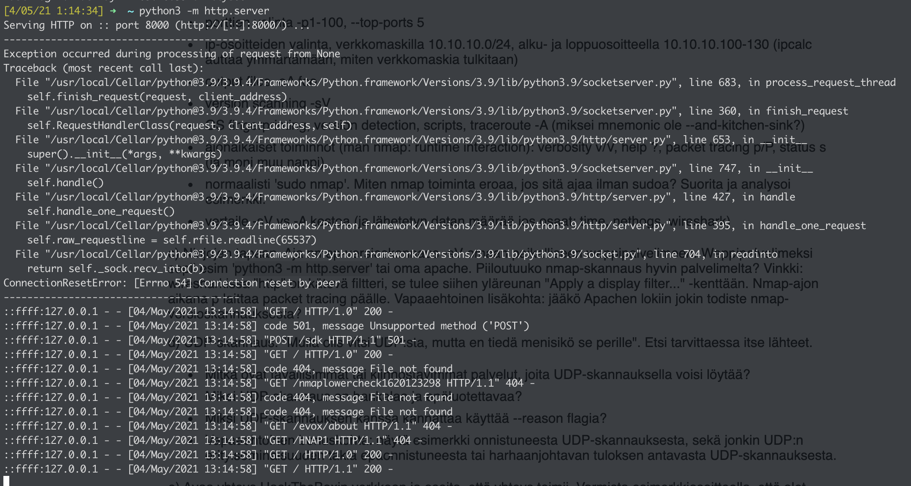
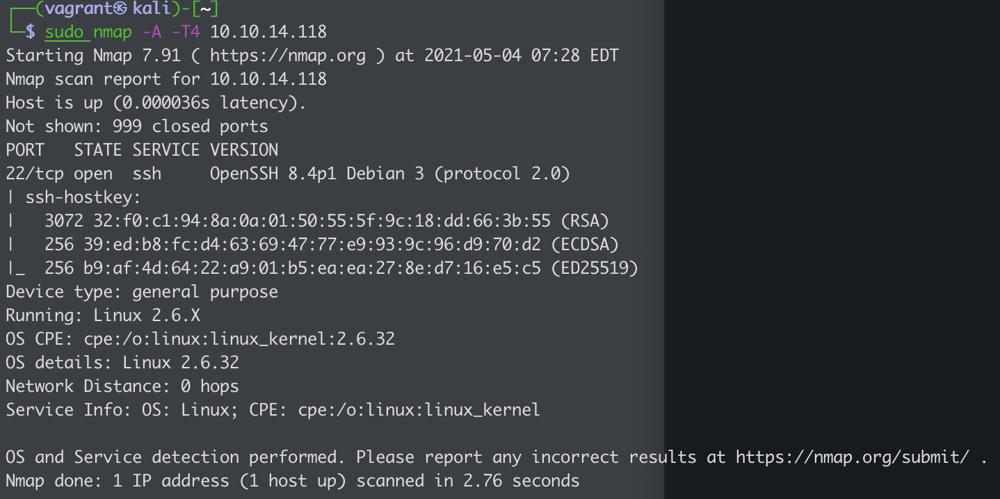

# H4 - Active Recon and Nmap

Solutions for week four [assignments](https://terokarvinen.com/2021/hakkerointi-kurssi-tunkeutumistestaus-ict4tn027-3005/#h4-aktiivinen-tiedustelu-ja-nmap).

## Table of Contents

* [Assignments](#assignements)
  * [z) Read and reference materials](#z-read-and-reference-materials)
  * [a) How nmap works?](#a-how-nmap-works)
  * [b) Nmap functionality](#b-nmap-functionality)
  * [c) Ninja ways](#c-ninja-ways)
  * [d) UDP-scan](#d-udp-scan)
  * [e) Connect into HackTheBox network and verify](#e-connect-into-hackthebox-network-and-verify)
  * [f) Recon actively some HackTheBox machines](#f-recon-actively-some-hackthebox-machines)
  * [g) Recon actively HackTheBox machines with other tooling](#g-recon-actively-hackthebox-machines-with-other-tooling)
  * [h) HackTheBox](#h-hackthebox)
* [References](#references)

---

## Assignments

### z) Read and reference materials

- Santos et al: The Art of Hacking (Video Collection): [..] 4.3 Surveying Essential Tools for Active Reconnaissance.
  - Active Reconnaissance
    - Sending packets directly to target environment
    - Will set of alarms
  - Passive Reconnaissance
    - Not visible to target
  - Active Methologies
    - port scanning, web service review, vulnerability scan
    - very noisy
  - [NMAP](https://nmap.org)
    - port scanner
    - recommended switches:
      - Pn - treat all hosts are up
      - p - port
  - [MASSSCAN](https://github.com/robertdavidgraham/masscan)
    - similar tool as nmap
    - fastest scanning tool
  - [UDP Protocol Scanner](https://github.com/CiscoCXSecurity/udp-proto-scanner)
    - Fast UPD port scanner
  - [EyeWitness](https://github.com/FortyNorthSecurity/EyeWitness)
    - Web Service Review
    - Finds out web sites automatically

- Lyon 2009: Nmap Network Scanning: Chapter 1. Getting Started with Nmap
  - Avatar Online Pen testing scenario
  -  Start with passive scanning
    - list scan - sL - option
      - enumerates every IP address in the given target netblock(s) and does a reverse-DNS lookup (unless -n was specified) on each
        - stealthy - The names of the hosts can hint at potential vulnerabilities and allow for a better understanding of the target network, all without raising alarm bells[3]
        - double-check that the IP ranges are correct
  - Move on to active scanning
    - enable aggressive scans
      - banner grabbing
      - A - option
  - Matrix example
  - nmap-report tool for generating reports

- Lyon 2009: Nmap Network Scanning: Chapter 15. Nmap Reference Guide
  - Nmap reports the state combinations
    - open|filtered and closed|filtered when it cannot determine which of the two states describe a port
  - Scan Techniques
    - sS - TCP SYN Scan
    - sT - Connect() Scan
    - sU - UDP Scan

---

### a) How nmap works?

 Tee nmapilla seuraavat testit, sieppaa liikenne snifferillä (wireshark) ja analysoi tulokset. Tee testit mahdollisimman suppeasti, jotta analysointi on helpompaa. Esimerkiksi skannaa vain yksi portti yhdestä koneesta, jos ominaisuuden esittely ei hyöydy laajemmasta skannauksesta. Selitä myös, miksi nmap lähettää tuollaisia paketteja. Käytä nmap:ia normaalisti sudo:n kanssa. Kannattaa tietysti aloittaa lukemalla man-sivulta tai Nmap Reference Guidesta, mitä noilla toiminnoilla on ylipäänsä tarkoitus tehdä. Porttiskannaa ainoastaan omaa konetta omassa verkossa ja harjoitusmaaleja.

Tässä a-kohdassa jokainen alakohta edellyttää siepattujen pakettien analyysia.

- TCP connect scan -sT
  - does a full TCP connect scan
    - SYN, SYN/ACK, ACK
- TCP SYN "used to be stealth" scan, -sS
  - does a half TCP connect scan
    - client sends in RST package closing the session after receiving SYN/ACK package
- ping sweep -sn
  - no port scan
  - sends in ARP request to all hosts
  - only scan
- don't ping -Pn
  - no ping scan, as in treat all hosts up and skip host discovery
  - looks to be combining stealth scan with ping sweep as I can see RST packages and ARP requests
- version detection -sV
  - Banner Grabbing
  - Nmap tries to identify the service and server from the port information
  - tried against HTTP server on port 80 and saw nmap doing a GET request in to / path
    - the server actually tells it's own server version on the server header in the HTTP response

---

### b) Nmap functionality

- port selection
  - -p1-100
    - scans ports between 1 and 100
    - useful for detecting a certain port range
  - --top-ports 5
    - scans five most popular (TCP by default) ports
    - 21, 22, 23, 80, 443

- ip selection
  - you can select network address or range
    - single address - 10.10.10.10
    - netmask - 10.10.10.0/24
    - range - 10.10.10.1-100

- output files -oA foo
  - NMAP can save outputs into three file formats
    - xml
    - plaintext
    - greppable text - recommended

- version scanning -sV
  - Nmap tries to identify the service and server from the port information
  - see [a) How nmap works?](#a-how-nmap-works)

- OS fingerprinting, version detection, scripts, traceroute -A
  - active scanning methods
  - will trigger alarms
  - banner grabbing

- runtime interaction)
  - verbosity v/V - more output
  - help - how to guide
  - packet tracing p/P
  - debug d/D - debug
  - status s - timing, etc. more status info

- sudo nmap
  - By default an unprivileged scan uses -sT (TCP Connect) while privileged (root) uses -sS (TCP SYN Stealth)
  - privileged scan uses raw sockets and packets, which require root privileges


---

### c) Ninja ways

- I setup a local http server using Python

  ```shell
  python3 -m http.server
  ```

- Then I ran nmap scan against it

  ```shell
  nmap -sV localhost -p 8000
  ```

- The scan was very visible in the http server

    

We could see that the connection was reset and get request to /nmaplowercheckXXX path was made, so one could determine that this was nmap scan from logs.

---

### d) UDP-scan

- Most common UDP services would be DNS, media streaming services, game services, local broadcasts, etc.
- UDP scanning is difficult as you don't get a response to UDP packet.
- Using the --reason flag with NMAP tells us why the connection is marked as filtered. For example scanning local DNS port tells us the port is not reachable using the --reason flag

  ```shell
  sudo nmap -sU localhost -p 53 --reason

  53/udp closed domain  port-unreach ttl 64
  ```

---

### e) Connect into HackTheBox network and verify

- I selected [HTB: Love](https://app.hackthebox.eu/machines/Love) machine and downloaded OpenVPN configuration beforehand.
- First I setup a Kali Vagrant box. We sync the OpenVPN configuration to the machine

  ```shell
  vagrant up kali
  vagrant ssh kali
  ```

- when Kali is running, I install OpenVPN for opening the VPN connection to HackTheBox

  ```shell
  sudo apt update
  sudo apt install -y openvpn
  ```

- then I ran OpenVPN with the configuration file to establish connection

  ```shell
  sudo openvpn config.ovpn
  ```

- Tested, that I'm connected to HackTheBox by pinging the target machine

  ```shell
  └─$ ping -c 1 10.10.14.118
  PING 10.10.14.118 (10.10.14.118) 56(84) bytes of data.
  64 bytes from 10.10.14.118: icmp_seq=1 ttl=64 time=0.015 ms

  --- 10.10.14.118 ping statistics ---
  1 packets transmitted, 1 received, 0% packet loss, time 0ms
  rtt min/avg/max/mdev = 0.015/0.015/0.015/0.000 ms
  ```

---

### f) Recon actively some HackTheBox machines

- I ran aggressive NMAP scan against the machine previously set up

  

- We can see that there is only single port open, which is 22/tcp, that is running OpenSSH version 8.4p1
- The box is most likely running Debian based Linux distribution
- We can see from the network distance, that the machine is 0 hops away, meaning we are in the same network.

---

## References

- [terokarvinen.com, H4 assignment](https://terokarvinen.com/2021/hakkerointi-kurssi-tunkeutumistestaus-ict4tn027-3005/#h4-aktiivinen-tiedustelu-ja-nmap)
- [nmap.org, NMAP](https://nmap.org)
- [github.com, MASSSCAN](https://github.com/robertdavidgraham/masscan)
- [github.com, UDP Protocol Scanner](https://github.com/CiscoCXSecurity/udp-proto-scanner)
- [github.com, EyeWitness](https://github.com/FortyNorthSecurity/EyeWitness)
- [HackTheBox.eu, Love](https://app.hackthebox.eu/machines/Love)
